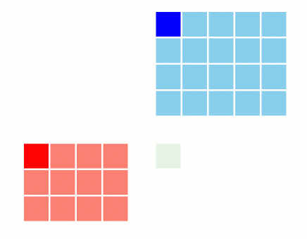
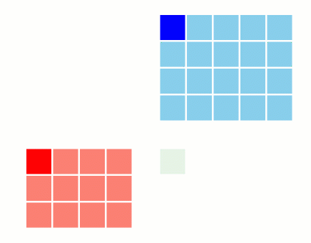

+++
title = "A small realisation about matrix multiplications"
date = "2025-01-06"
math = true
tags = [
  "CS", "CUDA", "GPU", 
]
+++

Recently, I realized something interesting about matrix multiplication. There's a less intuitive but more efficient way to think about it. Here's a technical breakdown of both perspectives and why the order of operations matters for cache efficiency - an insight that clicked while reading about how FlashAttention optimizes the attention mechanism by changing the order of operations.

## Matrix Mult. as Inner Product (The Human Way):


When we first learn matrix multiplication, we're taught to think about it as inner products. For matrices $A_{m \times n}$ and $B_{n \times o}$, their product $C = A @ B$ results in a matrix $C_{m \times o}$ where:
- For each element in $C$, we need to do an inner product of **each** row of A with **each** column of B.

In terms of operations:
- We need to compute $O(m \times o)$ different pairwise vector inner products
- Each inner product involves $n$ multiplications and additions
- For now, let's assume these vector operations are instantaneous (we'll discuss the reality later)

This is the natural way most people think about matrix multiplication - take a row from A, a column from B, multiply corresponding elements, and sum them up.

<!--  -->

## Matrix Mult. as Outer Product (The Machine Way):



Matrix $A @ B = C$ can also be thought of as the respective outer products of the **columns** of A with the **rows** of B.
There are $n$ columns of A and $n$ rows of B. For C, we need the outer product(Normal Matrix Multiplication) of each column ($m\times 1$) of A with ~~each~~ **respective** row ($1 \times o$)  of B (Not every row of B!) and simply add them ( Adding $n$ number of $m\times o$ shaped matrices). This means, under the hypothetical assumption that vectorwise operations are instantaneous, we only need to do $O(n)$ pairwise operations between vectors and not $O(n^2)$! 
[Note: The outer product of two vectors is a matrix, and the inner product of two vectors is a scalar.]


## Real life implications of the above:

In reality of course, pairwise operations between vectors aren't instantaneous. Each of the the $n$ outer product in second case takes $O(m \times o)$ FLOPs on its own. And in the first case, each of the $m \times o$ inner product takes $O(n)$ FLOPs on its own. Hence the number of multiplications that are being done is the same i.e. $O(m \times n \times o)$. 

However, the outer product approach is more cache friendly and therefore faster. Why? Because of the limitations in size of cache, whenever we multiply two vectors, assume that we can store only 2 (actually O(n)) vectors in the "immediate working memory"/"shared memory"/"L1 and L2 cache".
It happens to be that the overhead of bringing the vectors to the working memory from GPU's VRAM is significant to the actual computation! Therefore in the second case, we are doing $O(m \times o)$ operations (outer product) everytime we load two vectors while on the first inner product case, we would only doing $O(n)$ operations(dot product) for the two vectors loaded before having to load new vectors. This makes the outer product approach more cache friendly and faster in most kernels.

## What did we actually change?

To come to think of it, all we did was change the order of the loop of normal matrix multiplication. Instead of doing the normal $i,j,k$ loop, we did $k, i, j$ loop. Example in python:

```python
def matrix_multiply_inner(A, B):
    m, n = A.shape
    n, o = B.shape
    C = np.zeros((m, o))
    
    # Using three nested loops in the order of i, j, k
    for i in range(m):
        for j in range(o):
            # load the row i of A and column j of B to 
            # shared memory (2 vectors loaded m * o times)
            for k in range(n): 
                C[i, j] += A[i, k] * B[k, j]  # Doing n Element-wise 
                # multiplication and summation for the two 
                # vectors loaded aka inner product
    
    # The above is equivalent to the following:
    # for i in range(m):
    #     for j in range(o):
    #         C[i, j] = np.dot(A[i], B[:, j])  # Inner product

    return C

def matrix_multiply_outer(A, B):
    m, n = A.shape
    n, o = B.shape
    C = np.zeros((m, o))
    
    # Using three nested loops in the order of k, i, j
    for k in range(n):
        # load the column k of A and row k of B to shared memory
        # (2 vectors loaded n times)
        for i in range(m): 
            for j in range(o):  # The two above loops make O(m * o)
              # multiplications for the two vectors loaded aka outer product
                C[i, j] += A[i, k] * B[k, j]  #Accumulate outer product
                # contributions to its right place

    # The above is equivalent to the following:
    # for k in range(n):
    #     C += np.outer(A[:, k], B[k])  # Outer product

    return C
```

Hence we are loading vectors one order of magnitude less $(m \times o \to n)$ by going with the outer product approach.

## Conclusion

Thinking about matrix multiplication as inner products (row-by-column) or outer products (column-by-row) gives us two valid perspectives, but they’re not equally efficient in practice.

The key takeaway? How we write our loops matters. By understanding the math and the hardware, we can squeeze out better performance in our matrix multiplication code. Often times, the "human" and intuitive way of thinking about a concept may not be ideal. This realisation also hit me while  reading FlashAttention. In Attention, we often think from the perspective of queries and getting the correct combination of value vectors for this query using the keys. Though intuitive, this is not the most efficient way and switching the loop order is one of the key optimizations that enabled FlashAttention to tile the operations nicely and make it faster than the original.
In this small write up, we didn't look at any parallelism and yet managed to find ways to save some time. Next, We shall look at how further tiling and parallelisation can be done to make the matrix multiplication even faster. 

---

### References:

- [FlashAttention: Fast and Memory-Efficient Exact Attention with IO-Awareness](https://github.com/Dao-AILab/flash-attention)
- [Animation for inner and outer product taken from](https://towardsdatascience.com/hey-gpu-whats-up-with-my-matrix-cb7f6d7ae7d6#bypass)